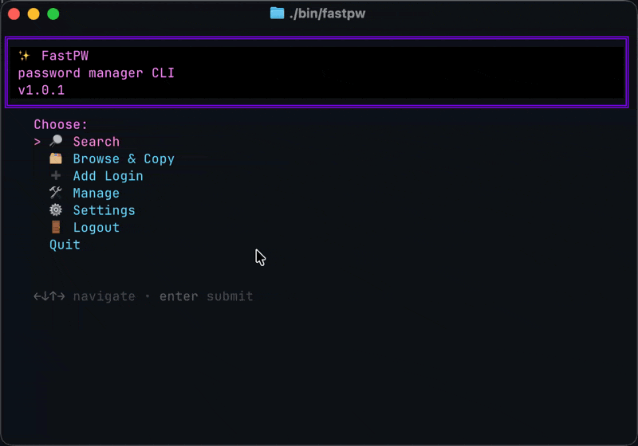

## FastPW



Fast, minimal CLI to store encrypted logins and copy fields from the terminal.

### Install
- macOS: `brew install charmbracelet/tap/gum jq`
- Ubuntu/Debian: `sudo apt install jq && curl -fsSL https://repo.charm.sh/apt/gpg.key | sudo gpg --dearmor -o /usr/share/keyrings/charm.gpg && echo "deb [signed-by=/usr/share/keyrings/charm.gpg] https://repo.charm.sh/apt/ /" | sudo tee /etc/apt/sources.list.d/charm.list && sudo apt update && sudo apt install gum`
- Fedora: `sudo dnf copr enable charmbracelet/gum && sudo dnf install gum jq`
- WSL/Linux: use your distro package manager

Requirements: Bash, OpenSSL, `jq`, `gum`, and a clipboard tool (`pbcopy`, `wl-copy`, `xclip`, or `xsel`).

### Setup
```bash
bin/fastpw --init    # create encrypted store with seed data
```

### Use
Interactive UI:
```bash
bin/fastpw
```

Non-interactive examples:
```bash
bin/fastpw --list
bin/fastpw copy --company "ACME" --login "prod" --field "password"
bin/fastpw company add "ACME"
bin/fastpw login add --company "ACME" --login "prod"
bin/fastpw field set --company "ACME" --login "prod" --field "username" --value "alice"
```

<!-- Import/Export removed -->

Reset (dangerous):
```bash
bin/fastpw reset
```

### Behavior
- Data is encrypted with OpenSSL AES-256-CBC using PBKDF2 (200k iterations).
- Master password is cached for 8 hours at `~/.fastpw/session.cache`.
- Data file: `~/.fastpw/data.enc.json`.

Env:
- `FASTPW_MASTER` pre-seeds the master password (useful in scripts/CI).
- `FASTPW_TIMEOUT` adds an inactivity timeout (seconds) to interactive prompts.

Run `bin/fastpw --help` for full usage.
